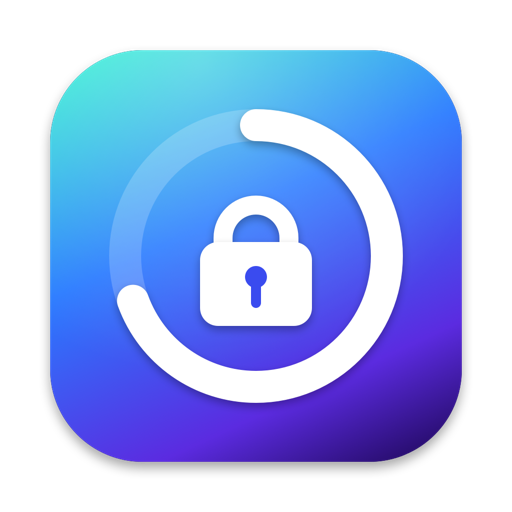

# simpleBackup

A tiny macOS menu bar app that backs up folders into password-protected [7-Zip](https://www.7-zip.org) archives.

Pick your folders in Settings, click one in the menu bar and watch the progress ring fill up. Each backup ends up as e.g. `Documents_2026-09-18.7z`, encrypted including file names (same as `7zz a -p -mhe=on`). The password is asked every time or stored in the macOS Keychain.

## Requirements

- macOS 14+
- 7-Zip: `brew install sevenzip`
- Xcode Command Line Tools: `xcode-select --install`

## Build

```sh
./build.sh           # builds build/simpleBackup.app
./build.sh install   # also copies it to /Applications and launches it
```
